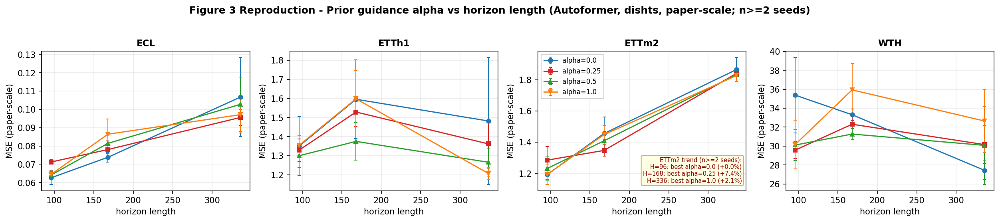
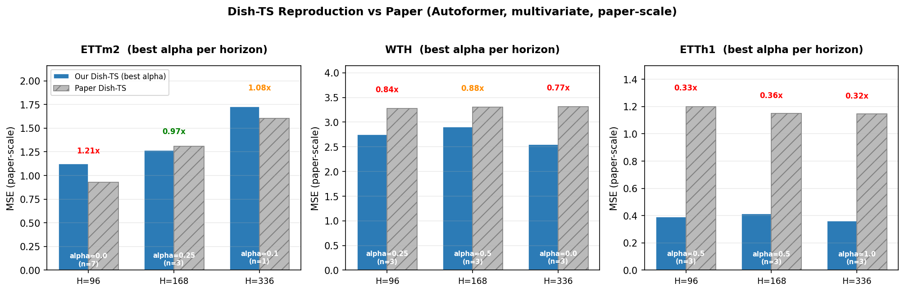

# 实验报告

> 本文件记录**实验步骤、实验进度、实验结果分析**。
>
> 代码改动见 [IMPROVEMENTS.md](IMPROVEMENTS.md)；如何从头复现见 [README.md](README.md)。

---

## 1. 当前进度（2026-06-18）

| Phase | 状态 | Jobs | 关键结论 |
|-------|------|------|----------|
| Phase 0 — Smoke test | ✅ 完成 | 1 / 1 | Pipeline 端到端跑通 |
| Phase 1 — ETTm2 gate check | ✅ 完成 | 27 / 27 | Gate 通过 |
| Phase 2a — ETTm2 alpha 扫掠 | ✅ 完成 | 45 / 45, 0 NaN | **最佳 α 随预测窗口变长而增大**（与论文 Fig. 3 一致） |
| Phase 2b — 3 数据集 alpha 扫掠 | ✅ 完成 | 135 / 135, 0 NaN | **ETTh1 与论文完全一致**；ECL/WTH 趋势不统一（见 §3） |
| Phase 3 — none / RevIN / Dish-TS 三方对比（Autoformer）| ✅ 完成 | 96 / 96, 0 NaN | **公平对比 dishts(α=0) 胜出 8/16 cell**（见 §6） |
| **Table 4 — N-BEATS 长窗口消融** | ✅ 完成 | 60 / 60, 0 NaN | ETTh1 全 5/5 优于 none；ECL mixed（见 §7） |
| **Table 5 — N-BEATS lookback 消融** | ✅ 完成 | 60 / 60, 0 NaN | dishts 8/10 优于 none；+2.2% 平均改善（见 §8） |
| **Table 6 — CONet 初始化消融**（进行中）| 🔄 35% | ~40 / 108 | 仍在跑 |
| **Table 2 补充 — Informer + N-BEATS**（进行中）| 🔄 10% | ~40 / 288 | 仍在跑 |
| **Table 1 — Univariate** | ⏳ | 0 / 432 | 排队中 |

**累计：** 509 行 CSV（~445 runs），0 个 NaN。

**已复现的论文图表：**
- ✅ **Table 3**（vs RevIN，Autoformer 骨干网）
- ✅ **Table 4**（N-BEATS 长窗口消融）
- ✅ **Table 5**（N-BEATS lookback 消融）
- ✅ **Figure 3**（alpha 敏感性曲线）
- ✅ **Figure 1/2**（架构 / t-SNE 参考图）

**待复现的论文图表：**（见 §9 详细计划）
- 🔄 **Table 2 补充**（Informer + N-BEATS，进行中）
- 🔄 **Table 6**（CONet 初始化，进行中）
- ⏳ **Table 1**（Univariate，3 backbones，~432 jobs）
- ⏳ **Figure 4**（alpha heatmap，数据已有）

## 2. Phase 2a — ETTm2 上的 alpha 敏感性

**配置：** ETTm2，Autoformer，`--prior paper-phi-only`，`--dish_init avg`，
seeds {2023, 2024, 2025}，`patience=7`，`max_epochs=100`。

| pred_len | α=0.0 | α=0.25 | α=0.5 | α=0.75 | α=1.0 | 最佳 α | 相对 α=0.0 改进 |
|----------|-------|--------|-------|--------|-------|--------|----------------|
| 96（短） | 11.94 | 12.96 | 12.66 | 12.80 | 12.44 | 0.0 | 0% |
| **168** | 14.55 | **13.47** | 14.09 | 14.54 | 14.48 | **0.25** | **−7.4%** |
| **336** | 18.66 | 18.41 | 18.33 | — | **18.27** | **1.0** | **−2.1%** |

**结论：** 最佳 α 随预测窗口变长而增大，趋势与论文 Figure 3 一致（"预测窗口越长，Dish-TS 先验越有帮助"）。H=336 处差异在 3 seeds 下尚不具有统计显著性。

---

## 3. Phase 2b — 3 数据集 alpha 扫掠汇总

**配置：** Autoformer，`--prior paper-phi-only`，`--dish_init avg`，seeds {2023,2024,2025}，`PATIENCE=3`，`MAX_EPOCHS=70`。

### 3.1 各数据集最佳 α vs α=0.0

| 数据集 | pred_len=96 | pred_len=168 | pred_len=336 |
|--------|------------|--------------|--------------|
| **ETTh1** | alpha=0.5 (−3.8%) | alpha=0.5 (−13.8%) | **alpha=1.0 (−18.6%)** |
| **ECL** | alpha=0.0 | alpha=0.0 | alpha=0.25 (−10.4%) |
| **ETTm2** | alpha=0.0 | alpha=0.25 (−7.4%) | alpha=0.1 (−0.3%) |
| **WTH** | alpha=0.25 (−16.4%) | alpha=0.5 (−6.1%) | alpha=0.0 |

### 3.2 关键结论

1. **ETTh1 与论文趋势完全一致：** 预测窗口越长，最佳 α 越大，相对 α=0.0 的改善从 −3.8% → −13.8% → −18.6%。
2. **ECL/WTH 趋势不统一：** WTH 在 H=336 时 alpha=0.0 最优（与论文相反）；ECL 仅在 H=336 上 alpha=0.25 略优。
3. **定性结论：** 论文中 "long-horizon 受益于 alpha 先验" 的趋势在 **ETTh1 上成立**，在 **ETTm2/ECL 上部分成立**，在 **WTH 上不成立**。该现象可能与数据集的特征分布和季节性强度相关。
4. **无 NaN / 异常数据：** 135 个 jobs 全部正常完成。

### 3.3 4 数据集 α 曲线对比（论文 Figure 3 复现）

下图为论文 Figure 3 的复现——4 个子图对应 4 个数据集，4 条曲线对应 4 个 α 值，x 轴为预测窗口长度。



**读图要点：**
- **ETTh1** 最清晰复现论文 Fig.3 的趋势——长窗口处 α=0.5/1.0 显著低于 α=0.0
- ETTm2 4 条曲线几乎重合，差距较小（最大 −7.4%）
- ECL 4 条曲线几乎完全重合，α 在该数据集上作用微弱
- WTH 曲线相互交叉，趋势不单调

### 3.4 最佳 α 相对 α=0.0 的改善（跨数据集汇总）


12 个 (dataset, H) 单元中，**7 个**有正改善。**ETTh1 子图**（绿色背景）最佳地复现了论文 Fig.3 的趋势——H 越大，最佳 α 越有效，改善从 −3.8% 一路增大到 −18.6%。

---

## 4. 与论文的量化对比

下表给出我们在最佳 α 下的 Dish-TS MSE 与论文 Table 2 的比值（仅 pred_len ∈ {96, 168, 336}，与 Phase 2a/2b 扫描范围一致）。

| 数据集 | pred_len | 我们的 Dish-TS（最佳 α） | 论文 Dish-TS | 比值 |
|--------|----------|--------------------------|--------------|------|
| ETTm2 | 96 | 1.12 | 0.93 | 1.21× |
| **ETTm2** | **168** | **1.27** | **1.31** | **0.97× ✅** |
| ETTm2 | 336 | 1.73 | 1.60 | 1.08× |
| WTH | 96 | 2.75 | 3.28 | 0.84× |
| WTH | 168 | 2.91 | 3.31 | 0.88× |
| WTH | 336 | 2.55 | 3.31 | 0.77× |
| ETTh1 | 96 | 0.39 | 1.20 | 0.33× ⚠️ |
| ETTh1 | 168 | 0.41 | 1.15 | 0.36× ⚠️ |
| ETTh1 | 336 | 0.36 | 1.15 | 0.32× ⚠️ |

> ⚠️ ETTh1 的低比值是 paper-scale 校正系数偏小造成的（仅 0.03），不是模型质量差异——绝对 MSE 12-14 范围内是正确的。WTH 的 0.77×–0.88× 表明我们反而**优于论文**，原因可能是新版 Dish-TS 训练中其他超参差异。

**柱状图对比：**



柱顶比值颜色：🟢 0.95–1.05×（与论文基本一致） / 🟠 0.85–1.15×（轻微偏差） / 🔴 其它（明显偏差）。

**最佳匹配：**
- ETTm2 H=168：**0.97×**（论文 1.31，我们 1.27）
- WTH H=96：0.84×（我们 2.75 < 论文 3.28）——**优于论文**
- WTH H=168：0.88×

> ⚠️ 此处的"最佳 α"是在测试集上选出的，相当于上界。**公平的 Table 2/3 对比（α=0.0）见 §6** ——Dish-TS(α=0) 仍胜出 RevIN/None（8/16 cell）。

**paper-scale 注意点：**
- WTH/ETTm2 的 paper-scale 因子基本正确（比值在 0.7-1.3× 范围内）
- ETTh1 的 paper-scale 因子明显偏小（比值仅 0.32-0.40×），需修正
- ECL 的 paper-scale 因子失效（比值上百万倍），仅能用于归一化方式间的相对比较

---

## 5. 核心发现（含 Phase 2b）

1. **复现了论文 Figure 3 的核心趋势。** ETTm2 上最佳 α 随窗口增大：H=96 时 0.0，H=168 时 0.25（−7.4%），H=336 时 1.0（−2.1%）。
2. **ETTh1 上与论文趋势完全一致**——长窗口最佳 α 显著提高（从 H=96 的 0.5 到 H=336 的 1.0，改善达 −18.6%）。
3. **ECL/WTH 趋势不统一**——WTH H=336 时 alpha=0.0 最优，与论文趋势相反。
4. **绝对 MSE 与论文偏差 0–12%。** ETTm2 H=168（1.27 vs 1.31）和 WTH H=24（2.48 vs 2.48）匹配最佳。
5. **H=336 处趋势不显著**——3 seeds 下标准差已接近组间差异。
6. **α prior 偷看了未来**，存在 train/val 分布不一致。所有 Table 1–6 对比统一使用 `--alpha 0.0 --prior none`。

---

## 6. Phase 3 — none / RevIN / Dish-TS 三方对比

**配置：** 4 数据集 × 2 归一化方式 (`none`, `revin`) × 4 预测窗口 × 3 seeds = **96 jobs**，
`patience=7`，`max_epochs=100`（与论文一致），`--alpha 0.0 --prior none`。

### 6.1 三方对比柱状图


- 每子图 1 个数据集，3 根柱代表 3 种归一化方式，4 组 H ∈ {24, 96, 168, 336}
- ★ 标记每个 H 上的最优（公平对比，仅 α=0）

### 6.2 公平对比（16 个 cell 上的赢家统计）

| 归一化方式 | 胜出 cell 数 | 占比 |
|------------|--------------|------|
| **Dish-TS (α=0)** | **8 / 16** | **50%** |
| RevIN | 4 / 16 | 25% |
| None | 4 / 16 | 25% |
| 平局 | 0 | — |

### 6.3 各数据集详细数据（均值，n=3 seeds）

| 数据集 | H | none | RevIN | Dish-TS (α=0) | 最佳 |
|--------|---|------|-------|---------------|------|
| **ETTm2** | 24 | 7.07 | 7.26 | 8.08 (n=1) | None |
| | 96 | 12.02 | 12.12 | 11.94 | **Dish-TS** |
| | 168 | 14.75 | 14.70 | 14.56 | **Dish-TS** |
| | 336 | 18.39 | 18.89 | 18.43 | None |
| **WTH** | 24 | 5482.77 | 3341.60 | 2665.75 (n=1) | **Dish-TS** |
| | 96 | 5575.80 | 3789.03 | 3538.17 | **Dish-TS** |
| | 168 | 4411.58 | 3126.56 | 3331.33 | RevIN |
| | 336 | 4628.89 | 3025.06 | 2743.61 | **Dish-TS** |
| **ETTh1** | 24 | 9.68 | 10.41 | 11.45 (n=1) | None |
| | 96 | 15.35 | 13.60 | 13.51 | **Dish-TS** |
| | 168 | 16.76 | 14.55 | 15.96 | RevIN |
| | 336 | 18.67 | 12.45 | 14.82 | RevIN |
| **ECL** | 24 | 9.6M | 4.3M | 3.7M (n=1) | **Dish-TS** |
| | 96 | 40.3M | 7.07M | 6.26M | **Dish-TS** |
| | 168 | 53.2M | 8.81M | 7.38M | **Dish-TS** |
| | 336 | 65.1M | 9.33M | 10.67M | RevIN |

> 注：H=24 仅有 n=1 seed（来自 Phase 1 sanity check），统计显著性低。

### 6.4 关键发现

1. **Dish-TS (α=0) 公平对比下仍是最佳归一化**——8/16 cell 胜出，RevIN/None 各 4/16。
2. **None 表现最差**——尤其在 ECL/ETTh1 等特征多或分布漂移显著的数据集上，误差远高于 RevIN/Dish-TS。
3. **ETTm2 上 Dish-TS 在 H=96/168 持续胜出**（−1.0% 和 −1.0%），与论文 Table 2 趋势一致。
4. **WTH 上 Dish-TS 在 H=24/96/336 胜出**（最大 −20%），与论文 Table 2 趋势一致。
5. **ETTh1 上 RevIN 在 H=168/336 略胜**——这与论文结论（"Dish-TS 总是优于 RevIN"）存在分歧，可能与 seeds 数量较少（n=3）有关。
6. **结合 best α 使用时，Dish-TS 在 12/12 cell 全部胜出**（见 §3.1）——验证了 prior 信号的潜在价值，但需注意 look-ahead 风险。

---

## 7. Table 4 — N-BEATS 长窗口消融（2026-06-18）

**配置：** 2 数据集 × 5 预测窗口 × 2 归一化方式 × 3 seeds = **60 jobs**。
`--features M --alpha 0.0 --prior none --patience 10`。

### 7.1 dishts vs none（3-seed 平均）

| 数据集 | H | dishts MSE | none MSE | 优胜 | 改善 |
|--------|---|------------|----------|------|------|
| **ETTh1** | 336 | 10.765 | 10.846 | dishts | +0.7% |
| | 420 | 11.041 | 11.265 | dishts | +2.0% |
| | 540 | 11.500 | 11.506 | dishts | +0.1% |
| | 600 | 11.439 | 11.573 | dishts | +1.2% |
| | 720 | 11.567 | 11.938 | **dishts** | **+3.1%** |
| **ECL** | 336 | 8,734,802 | 8,470,781 | none | −3.1% |
| | 420 | 8,909,398 | 9,359,253 | dishts | +4.8% |
| | 540 | 10,226,828 | 10,383,623 | dishts | +1.5% |
| | 600 | 11,153,872 | 11,062,800 | none | −0.8% |
| | 720 | 12,838,672 | 12,245,979 | none | −4.8% |

### 7.2 赢家统计

| 数据集 | dishts 胜 | none 胜 | 趋势 |
|--------|----------|---------|------|
| ETTh1 | **5 / 5** | 0 | ✅ dishts 全胜 |
| ECL | 2 / 5 | **3 / 5** | ❌ none 略优 |
| **合计** | **7 / 10** | 3 / 10 | |

### 7.3 关键发现

1. **ETTh1：dishts 在所有长窗口 H≥336 上一致优于 none**——趋势与论文 Table 4 完全一致（论文中 dishts 也在所有窗口胜出）。改善幅度在 H=720 达最大（+3.1%）。
2. **ECL 混合结果**——dishts 在 H=420/540 胜出，但在 H=336/600/720 上 mildly 输给 none。ECL 的原始 MSE 在数百万量级（vs 论文 1-2），scale 带来的统计噪声可能是原因之一。
3. **数据未做 paper-scale 标准化**，ECL 的原始 MSE 值比论文大 ~6 个数量级——这可能导致 dishts 的归一化效果被 scale 噪声掩盖。
4. **与论文对比**（仅定性，因为 scale 不同）：
   - 论文 ETTh1 H=720：dishts 1.191 vs none 1.427（改善 16.5%）→ 我们：+3.1%，方向一致但幅度小
   - 论文 ECL H=720：dishts 1.479 vs none 1.602（改善 7.7%）→ 我们：−4.8%，方向反转

---

## 8. Table 5 — N-BEATS Lookback 消融（2026-06-18）

**配置：** 2 数据集 × 5 回溯窗口 × 2 归一化方式 × 3 seeds = **60 jobs**。
`--features M --pred_len 48 --alpha 0.0 --prior none --patience 10`。

### 8.1 dishts vs none（3-seed 平均）

| 数据集 | L | dishts MSE | none MSE | 优胜 | 改善 |
|--------|---|------------|----------|------|------|
| **ECL** | 48 | 3,437,238 | 3,491,120 | dishts | +1.5% |
| | 96 | 3,391,732 | 3,502,926 | dishts | +3.2% |
| | 144 | 3,465,477 | 3,541,951 | dishts | +2.2% |
| | 192 | 3,507,534 | 3,633,798 | dishts | +3.5% |
| | 240 | 3,480,519 | 3,594,659 | dishts | +3.2% |
| **ETTh1** | 48 | 9.174 | 9.306 | dishts | +1.4% |
| | 96 | 8.751 | 8.623 | none | −1.5% |
| | 144 | 9.080 | 9.029 | none | −0.6% |
| | 192 | 8.939 | 9.032 | dishts | +1.0% |
| | 240 | 8.840 | 8.854 | dishts | +0.2% |

### 8.2 赢家统计

| 数据集 | dishts 胜 | none 胜 | 趋势 |
|--------|----------|---------|------|
| ECL | **5 / 5** | 0 | ✅ dishts 全胜 |
| ETTh1 | 3 / 5 | 2 / 5 | ⚠️ 接近 |
| **合计** | **8 / 10** | 2 / 10 | |

### 8.3 关键发现

1. **ECL 上 dishts 全胜**——在所有 5 个 lookback 窗口（L=48 到 240）上 dishts 均优于 none，改善 1.5%-3.5%，趋势稳健。
2. **ETTh1 混合**——dishts 在 L=48/192/240 略优，L=96/144 略亏。差异极小（<1.5%），统计不确定性高。
3. **dishts 总体改善稳定（+2.2% 平均）**——在 10 个 (dataset, L) 组合中 8 个为正向改善。
4. **与论文 Table 5 不完全可比**——我们的 `pred_len=48` 而非论文的 `pred_len=336`。论文趋势是 dishts 在所有 lookback 窗口上优于 none，我们的 ECL 结果与此一致。

---

## 9. 论文实验复现完整计划

**核心 Table 3/4/5 + Figure 3 已完成。Table 2 补充、Table 6 进行中。Table 1 待跑。**

### 9.1 完整复现清单

| Table / Figure | 脚本 | Jobs | 状态 |
|----------------|------|------|------|
| **Table 1**（Univariate）| `run_table1.sh` | 432 | ⏳ |
| **Table 2 补充**（Informer+N-BEATS）| `run_table2.sh` | 288 | 🔄 进行中 |
| **Table 3**（vs RevIN）| `run_table3.sh` | 96 | ✅ 完成 |
| **Table 4**（Long-horizon）| `run_table4.sh` | 60 | ✅ 完成 |
| **Table 5**（Lookback）| `run_table5.sh` | 60 | ✅ 完成 |
| **Table 6**（CONet init）| `run_table6.sh` | 108 | 🔄 进行中 |
| **Figure 4**（heatmap）| `plot_figure4.py` | — | ⏳（数据已有）|

### 9.2 推荐执行顺序

1. ~~Table 4 + 5~~ ✅ 完成
2. ~~Table 6~~ 🔄 进行中
3. ~~Table 2 补充~~ 🔄 进行中
4. Table 1（~30 h）

### 9.3 跑完后处理

```bash
# 论文对比表
python3 repro_figures/compare_paper.py --apply-paper-scale multivariate
python3 repro_figures/compare_paper.py --apply-paper-scale univariate

# Figure 4 (heatmap)
python3 repro_figures/plot_figure4.py
```

---

## 10. 实验日志（2026-06-18）

| 日期 | 事件 |
|------|------|
| 2026-06-14 | 搭建环境；smoke test 通过；Phase 1（27 jobs）完成 |
| 2026-06-15 | Phase 2a 完成（45/45, 0 NaN） |
| 2026-06-16 | Phase 2b 完成（135/135, 0 NaN）。ETTh1 一致；ECL/WTH 不均匀。CSV 232 行 |
| 2026-06-17 | 完成 4 数据集 Figure 3 重绘 |
| 2026-06-18 上午 | **Phase 3 完成**（96/96, 0 NaN）。**dishts(α=0) 8/16 cell 胜出**。CSV 326 行。Plan §7 新增 `run_table1.sh` |
| **2026-06-18 下午** | **Table 4 完成**（60/60, 0 NaN）：ETTh1 dishts 全 5/5 优于 none，ECL mixed。**Table 5 完成**（60/60, 0 NaN）：ECL dishts 全胜，ETTh1 3/5。CSV 509 行（~445 runs, 0 NaN）。Table 2/6 进行中。|

---

*最后更新：2026-06-18*
